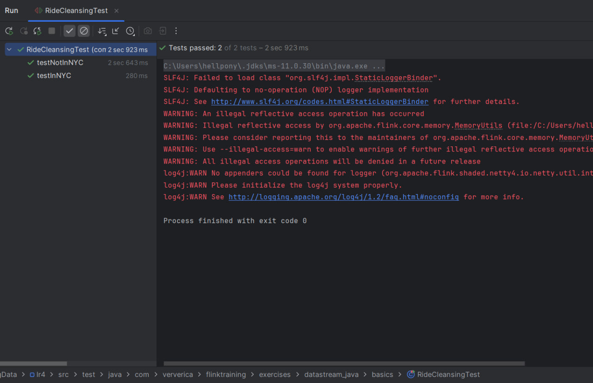
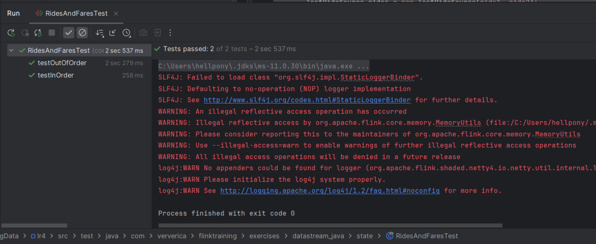
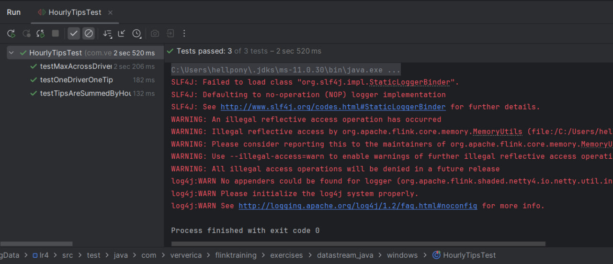
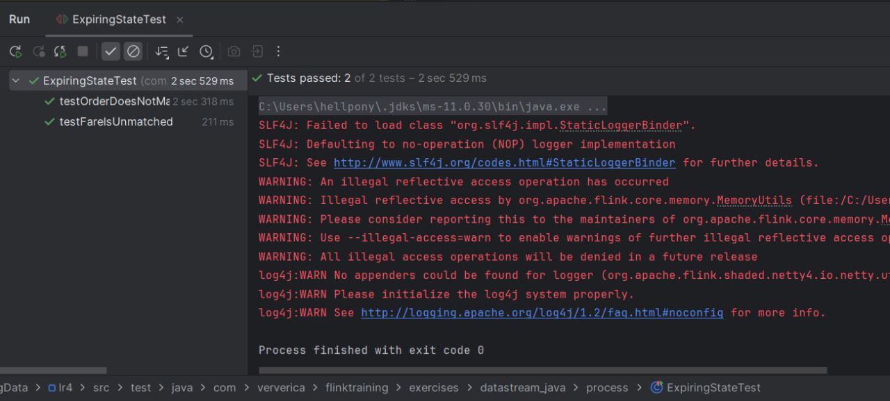

**⚠️ This repository has been archived and is no longer being maintained. For up-to-date content, see https://github.com/ververica/flink-training. ⚠️**

---

This repository contains examples and exercises for Apache Flink.

---

# Отчёт по ЛР3
## Потоковая обработка данных в Apache Flink

## Задание

Выполнить следующие задания из набора заданий репозитория https://github.com/ververica/flink-training-exercises:
- RideCleansingExercise
- RidesAndFaresExercise
- HourlyTipsExercise
- ExpiringStateExercise

Решения выполнены на языке Java. Каждому заданию соответствует `.java` файл с шаблоном решения и файл с тестом решения.  Тесты расположены в папке `test`.

Для выполнения заданий используется датасет с данными о поездках такси в Нью-Йорке https://github.com/apache/flink-training/blob/master/README.md#using-the-taxi-data-streams.
Файлы `nycTaxiFares.gz` и `nycTaxiRides.gz` вы можете найти в папке `data` https://gitlab.com/ssau.tk.courses/big_data/-/tree/master/data.

---

## Ход работы
### 1. RideCleansingExercise
Отфильтровать поток событий TaxiRide, оставив только те поездки, которые начинаются и заканчиваются в пределах NY.

[Файл](./src/main/java/com/ververica/flinktraining/exercises/datastream_java/basics/RideCleansingExercise.java)

Тесты `RideCleansingTest`:

---

### 2. RidesAndFaresExercise
Объединить два потока данных: поток поездок TaxiRide и поток оплат TaxiFare.
Объединение выполняется по общему ID поездки rideId.

[Файл](./src/main/java/com/ververica/flinktraining/exercises/datastream_java/state/RidesAndFaresExercise.java)

Тесты `RidesAndFaresTest`:

---

### 3. HourlyTipsExercise
Определить водителя, который получил наибольшую сумму чаевых за каждый час.

[Файл](./src/main/java/com/ververica/flinktraining/exercises/datastream_java/windows/HourlyTipsExercise.java)

Тесты `HourlyTipsTest`:

---

### 4. ExpiringStateExercise
Объединить потоки TaxiRide и TaxiFare с автоматической очисткой состояния при отсутствии пары событий в течение заданного времени.

[Файл](./src/main/java/com/ververica/flinktraining/exercises/datastream_java/process/ExpiringStateExercise.java)

Тесты `ExpiringStateTest`:
